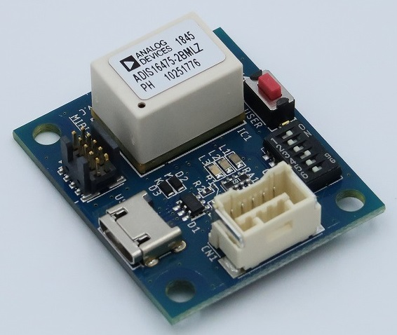
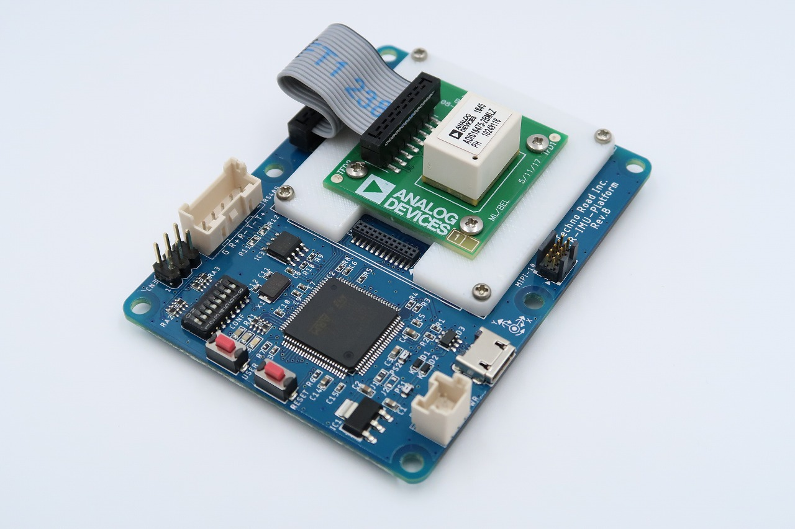
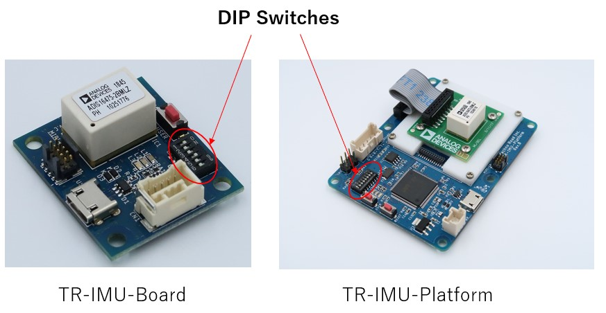
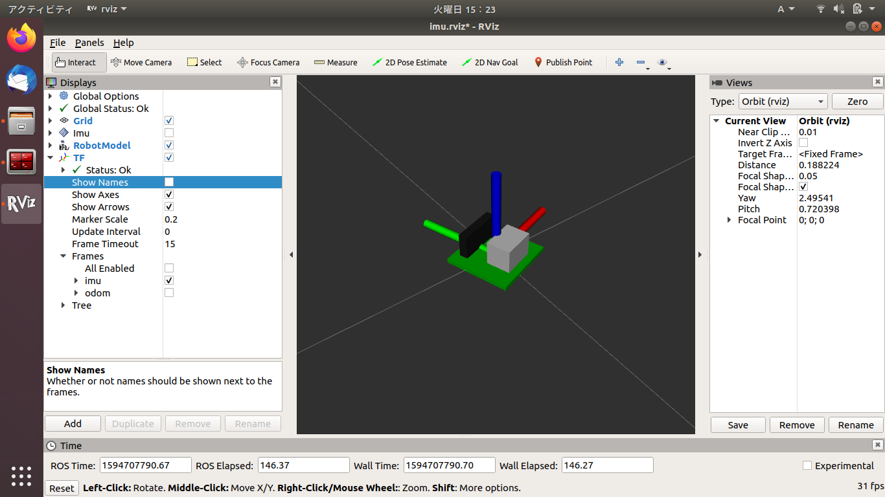

# TR-IMU1647X (1st Gen / CSV)

Driver for the TR-IMU1647X series, which communicates IMU data over CSV-formatted serial.

<div align="center">
  
  
</div>

## Compatible Sensors

- TR-IMU16470
- TR-IMU16475-2
- TR-IMU16477-2
- TR-IMU16495-2
- TR-IMU16500
- TR-IMU16505-2
- TR-IMU-Platform

## Supported Environments

| OS | ROS2 | Branch | Note |
|----|------|--------|------|
| Ubuntu 18.04 LTS | Dashing / Eloquent | `dashing_eloquent` | No longer maintained |
| Ubuntu 20.04 LTS | Foxy / Galactic | `foxy_galactic` | No longer maintained |
| Ubuntu 22.04 LTS | Humble | `humble` | |
| Ubuntu 24.04 LTS | Jazzy | `jazzy` | |

## Setup

### Port Permissions

Add the user to the `dialout` group to access the USB port. (Skip if already done.)

```
$ sudo usermod -aG dialout $USER
```

Log out and log back in for the change to take effect.

### DIP Switch Settings

- TR-IMU16470 / TR-IMU16475-2: Turn on No.1 and No.4, turn off all others.
- TR-IMU-Platform: Turn on No.1 and No.5, turn off all others.

<div align="center">
  
</div>

After setting the switches, connect the sensor via USB.

### Install
Navigate to the `src` directory of your workspace and run the following commands.
```
$ cd [your workspace directory]/src
$ git clone --recursive https://github.com/technoroad/ADI_IMU_TR_Driver_ROS2
$ cd [your workspace directory]
$ rosdep update
$ rosdep install --from-paths src --ignore-src --rosdistro ${ROS_DISTRO} -y
```

### Build

```
$ cd [your workspace directory]
$ colcon build --symlink-install --cmake-args -DCMAKE_BUILD_TYPE=Release --packages-select adi_imu_tr_driver_ros2
$ source ./install/setup.bash
```

## Usage

This driver has two operating modes.

### Attitude Mode (On-board angle estimation + RViz visualization)

```
$ ros2 launch adi_imu_tr_driver_ros2 adis_rcv_csv.launch.py mode:=Attitude device:=/dev/ttyACM0
```

The ADIS16470 breakout board model is displayed in RViz2.

<div align="center">
  
</div>

### Register Mode (Acceleration and gyro output)

```
$ ros2 launch adi_imu_tr_driver_ros2 adis_rcv_csv.launch.py mode:=Register device:=/dev/ttyACM0
```

```
$ ros2 topic echo /imu/data_raw
```

## Topics

| Topic | Type | Description |
|-------|------|-------------|
| `/imu/data_raw` | sensor_msgs/Imu | Acceleration and angular velocity (Register mode) |
| `/diagnostics` | diagnostic_msgs/DiagnosticArray | Sensor status |

## Service Commands

Calibration (Attitude mode only):
```
$ ros2 service call /imu/cmd_srv adi_imu_tr_driver_ros2/srv/SimpleCmd "{cmd: 'START_BIAS_CORRECTION', args: []}"
```

Attitude reset (Attitude mode only):
```
$ ros2 service call /imu/cmd_srv adi_imu_tr_driver_ros2/srv/SimpleCmd "{cmd: 'RESET_FILTER', args: []}"
```

Get error code:
```
$ ros2 service call /imu/cmd_srv adi_imu_tr_driver_ros2/srv/SimpleCmd "{cmd: 'error', args: []}"
```

Note: Sending the `help` command stops data transmission. Use the `start` command to resume.
